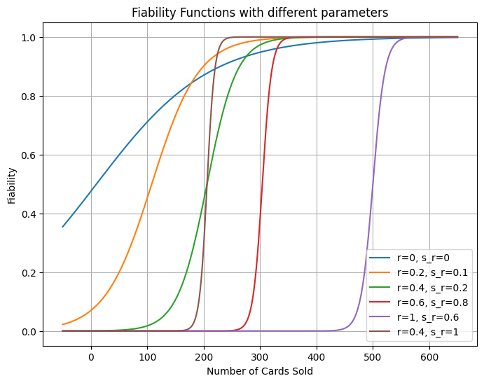

# Pokemon Card Investment Portfolio 🃏

With the emergence of the new Pokemon App (Pokemon TCGPlayer) and the growing popularity of the franchise, Pokemon has reached its peak in 2024. The latest card collections have become increasingly expensive, as many people seek to profit from collecting them, turning these cards into genuine investment assets.

This project aims to create an **investment portfolio for Pokémon cards** by leveraging historical price trends and financial modeling. 

The main objective is to execute all key steps of a data science project, from data scraping and analysis to statistical modelling, culminating in the visualisation and presentation of results.

Here is the structure of the project : 
- Data Scraping from [TCGPlayer](https://www.tcgplayer.com/search/pokemon/product?productLineName=pokemon&page=1&view=grid) 🛠️
-  Data Analysis & Statistics 🔎
-  Portfolio Optimization with Markowitz Model 🧠
-  Visualization & Results

## Code Architecture

- `main.ipynb` : Main interactive notebook for project exploration and execution.
- `requirements.txt` : Dependencies and package installation requirements.
- `analysis.ipynb` : Statistical analysis and data exploration of Pokemon cards.

- `datas/` :  
    - `pokemon_cards.csv` : The primary CSV file containing comprehensive information on all Pokemon cards.
    - `pokemon_data_popularity` : Dataset ranking the top 240 Pokemon by popularity.
    - `price_history/` : Directory containing ~3,600 individual card price history files.
- `PokemonCardManager.py` : Card information extraction and processing module. Updates `pokemon_cards.csv` with new card data.

- `GetHistoricCardPrices.py` : Price history extraction module for all cards listed in `pokemon_cards.csv`.

- `UsefulFunctionsForModels.py` : Utility functions supporting the Markowitz Portfolio Optimization Model.

- `MarkowitzPortfolioOptimizer.py` : Implementation of the Markowitz Model adapted for Pokemon card trading with binary weights.
- `PlotsStreamlit.py` : Visualization functions for Streamlit dashboard and portfolio analysis.
## Data Scraping from TCGPlayer 🛠️

### `pokemon_cards.csv`
This section aims to provide a concise explanation of how we scraped all Pokémon cards and generated the primary dataset, `pokemon_cards.csv`.

Data Source
We utilized the PokemonTCGPlayer API (https://api.pokemontcg.io/v2/cards) to extract data. Specifically, we scraped the first 250 pages of Pokémon cards listed on the platform, focusing on cards valued above $5. This filtering ensures that the dataset includes cards with a minimum monetary value.

Dataset Contents
The resulting CSV file contains the following columns:

- `id`: Unique identifier for each card
- `name`: Name of the card
- `rarity`: Rarity level of the card
- `collection`: Set or collection to which the card belongs
- `series`: Card series
- `holofoil_price`: Price of the holofoil version
- `reverse_holofoil_price`: Price of the reverse holofoil version
- `release_date`: Release date of the card
- `nationalPokedexNumbers`: Associated Pokédex number(s)
- `artist`: Illustrator of the card
- `images_url`: URL to the card's images
- `popularity_rank`: Popularity ranking of the card

### `price_history`
This file contains the complete price history for the various extracted Pokémon cards. Each CSV file includes the following columns: `Dates`, `price_history`, `quantity_sold` (Number of cards sold over a specific period)

For each card, we accessed the URL `https://prices.pokemontcg.io/tcgplayer/{id}` using **ChromeDriver**. From this page, we extracted a unique price history for each card, focusing on cards in Near Mint condition (i.e., pristine condition). For more details on card conditions, see this [guide](https://help.tcgplayer.com/hc/en-us/articles/221430307-How-can-I-tell-what-condition-a-card-is-in?_gl=1*ndr0ag*_gcl_au*MTI4MTI4Nzk2LjE3MzEyNzg1OTYuMjA4MjY3NzExNC4xNzMxMjgwNzA2LjE3MzEyODI1NjM.*_ga*NjY1ODU1NjkzLjE3MzEyNzg1OTY.*_ga_VS9BE2Z3GY*MTczNDkxMDA4NS45My4wLjE3MzQ5MTAwODUuNjAuMC4w).

Additionally, we focused on the highest price for each rarity type (Holofoil, Reverse Holofoil, Normal).

The extraction process was conducted using **BeautifulSoup** and **Selenium**, as it required interacting with multiple buttons on the webpage to retrieve the desired condition and rarity data. The price history spans one year.

Note: Each card takes approximately 1 minute and 30 seconds to extract. If you plan to run the code, be prepared to allocate sufficient time. ⏳ ☠️
##  Data Analysis & Statistics 🔎

## Portfolio Optimization with Markowitz Model 🧠

For portfolio modeling, it was preferable to first implement a constrained minimization model inspired by Markowitz's framework.  

We have approximately 3600 extracted cards. The goal is to create a portfolio of 5 to 35 Pokémon cards for an investor based on their investment amount \(M\), risk aversion \(r\), and risk sensitivity \(s_r\).  

Each card is assigned its average annual logarithmic return and a reliability score, which will be explained later.  

### Logarithmic Return Formula  
The logarithmic return is calculated as:  
- $\sqrt{x}$
$$
R_t = \log\left(\frac{P_t}{P_{t-1}}\right)
$$  

The average logarithmic return is then defined as:  
$$
R_{\text{mean}} = \frac{1}{T} \sum_{t=1}^{T} R_t
$$  

Where:  
- \(R_{\text{mean}}\) is the mean logarithmic return.  
- \(T\) is the number of logarithmic returns for the card.  
- \(R_t\) represents the logarithmic return at iteration \(t\).  

### Reliability Score  
In addition to the mean return, the reliability score for each card is defined as:  
$$
F = \frac{1}{1 - \exp\left(-s_r(x - r)\right)}  
$$  

Where:  
- \(s_r\) is the risk sensitivity parameter, a value between 0 and 1:  
  - If \(s_r = 0\), the curve is very smooth, indicating low sensitivity to risk.  
  - If \(s_r = 1\), the curve becomes steep, indicating high risk aversion.  
- \(r\) is the risk aversion parameter, also a value between 0 and 1:  
  - If \(r = 0\), less frequently traded cards are considered.  
  - If \(r = 1\), only highly traded cards are considered.  

### Why Use the Sigmoid Function?  
To justify the use of the sigmoid function, here is a graph illustrating how reliability scores vary with different parameters:  

 

## Authors

- [Benabdesadok Nayel](https://www.github.com/octokatherine)
- [Kefi Wassim](https://www.github.com/octokatherine)
- [Ren Alexandre](https://www.github.com/octokatherine)

